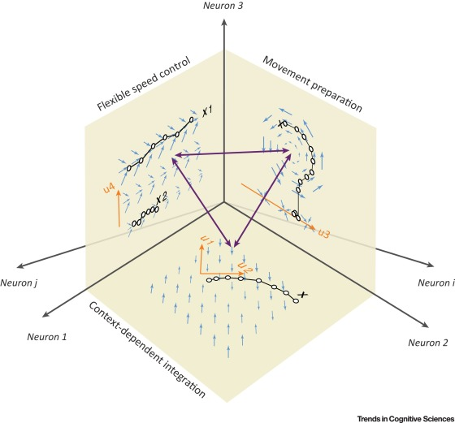

## Seth W. Egger

How does the brain allow for complex behaviors and cognition? How can we prepare different movements, integrate information, or flexibly decide based on context? A key idea is that, even if sensory inputs and motor outputs are unchanging, the internal workings of the brain perform computations that allow behavioral flexibility to be achieved. A corollary of this proposition is that the state of the brain must be controlled by internal processes such that they evolve towards a different state that is the output of this computation.

The processes by which internal states are controlled remain completely mysterious. One framework for approaching this problem is to think of the brain as a dynamical – much like the position of a boat in the tides will determine its course, the state of the brain at any momment will determine how that state changes over time. One momment might require a specific form of dynamics to integrate sensory information, while another momment might require another to prepare the right movements.

The key to understanding how the brain controls its internal states for cognition and complex behavior, therefore, might be in understanding the prinicples by which the underlying dynamical system is harnessed to perform specific computations. The main goal of my research is to develop models and perform experiments that allow us to infer these priniciples.

## Research projects
### [Internal models for action timing](Timing.md)
### Principles of gain control

## [CV](Egger_cv.pdf)
