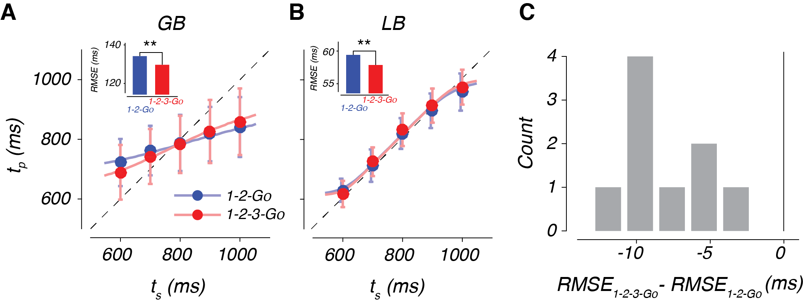

## Seth W. Egger

How does the brain allow for complex behaviors and cognition? Several decades of research have advanced the idea that the brain develops _internal models_ – models internal to the system that allow it to control complex systems and simulate outcomes. While this framework is instrumental to understanding sensorimotor behavior, the how the brain implements internal models remains quite mysterious.

Our approach is to study the brain as it takes in sensory information and updates the internal model to furnish predictions about the near future. Take, for example, a batter attepting to hit a ball in flight. Under the internal model framework, the batter's brain implements a model to simulate the ball's flight path. This simulation is continously updated by incoming visual information through the action of a state estimator and controller (Fig 1, top). The problem with studying this system is that we can't tell apart what aspects of neural signals reflect the sensory information about the ball, the simulation of the ball, or the motor commands related to hitting the ball. 


By introducing occluders that block vision of the ball, we allow ourselves the opportunity to measure the neural system as it carries out the simulation. Through a detailed analysis of human and nonhuman behavior, neurophsiological recordings of groups of neurons, and modeling, we attempt to garner a better understanding the algorithms and mechansims that allow for complex behaviors.

## Psychophysics
### Task and results



### Bayesian model


### EKF


## Physiology

Markdown is a lightweight and easy-to-use syntax for styling your writing. It includes conventions for

```markdown
Syntax highlighted code block

# Header 1
## Header 2
### Header 3

- Bulleted
- List

1. Numbered
2. List

**Bold** and _Italic_ and `Code` text

[Link](url) and 
```

For more details see [GitHub Flavored Markdown](https://guides.github.com/features/mastering-markdown/).

### Jekyll Themes

Your Pages site will use the layout and styles from the Jekyll theme you have selected in your [repository settings](https://github.com/swegger/swegger.github.io/settings). The name of this theme is saved in the Jekyll `_config.yml` configuration file.

### Support or Contact

Having trouble with Pages? Check out our [documentation](https://help.github.com/categories/github-pages-basics/) or [contact support](https://github.com/contact) and we’ll help you sort it out.
