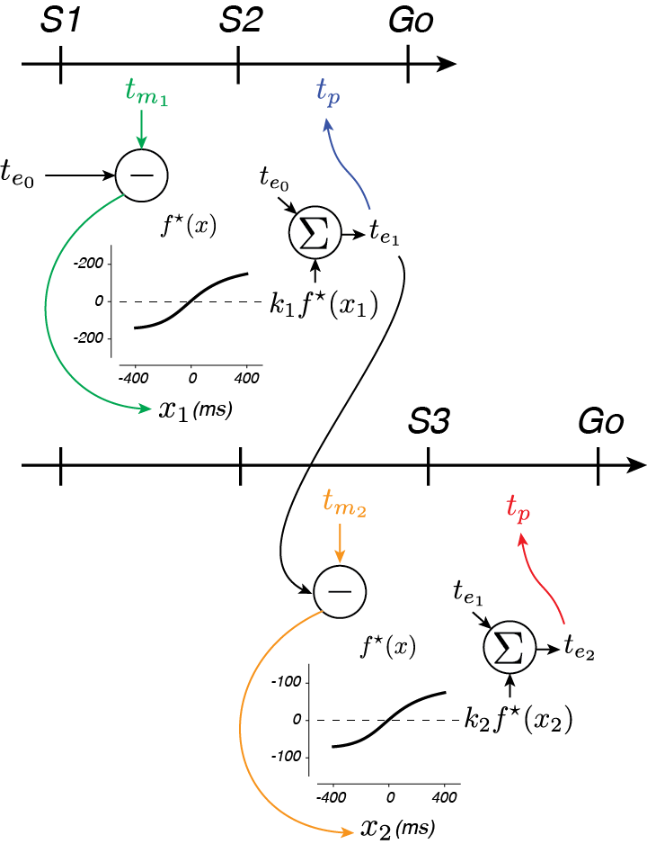

## Seth W. Egger

How does the brain allow for complex behaviors and cognition? Several decades of research have advanced the idea that the brain develops _internal models_ – models internal to the system that allow it to control complex systems and simulate outcomes. While this framework is instrumental to understanding sensorimotor behavior, how the brain implements internal models remains quite mysterious.

Our approach is to study the brain as it takes in sensory information and updates the internal model to furnish predictions about the near future. Take, for example, a batter attepting to hit a ball in flight. Under the internal model framework, the batter's brain implements a model to simulate the ball's flight path. This simulation is continously updated by incoming visual information through the action of a state estimator and controller (Fig 1, top). The problem with studying this system is that we can't tell apart what aspects of neural signals reflect the sensory information about the ball, the simulation of the ball, or the motor commands related to hitting the ball. 

By introducing occluders that block vision of the ball (Fig 1, bottom), we allow ourselves the opportunity to measure the neural system as it carries out the simulation. Through a detailed analysis of human and nonhuman behavior, neurophsiological recordings of groups of neurons, and modeling, we attempt to garner a better understanding the algorithms and mechansims that allow for complex behaviors.

## 1-2-Go and 1-2-3-Go
### Task and results
To bring the batter into the lab, we developed a temporal interception task (Fig 2A,B). In the task, our subjects view a series of flashes that make up a beat. Subjects view either the first two (A) or three (B) beats, and must make a movement that coincides with the final beat (which we never actually show them). Each trial, the interval between the flashes is sampled at random from a set distribution (Fig 2C). To successfully move with the beat, the subject must measure the sample interval, _ts_, and produce the same interval, _tp_, after the last flash.

The behavior of our subjects has three interesting features (Fig 3). First, _tp_ increases with _ts_, indicating that our subjects were capable of measuring the interval. Second, they exhibit a systematic biasing of responses away from veridical _ts_ (the dashed line) and toward the mean of the distribution from which they were drawn (800 ms in this case). Finally, subject behavior improved when they were given three beats (1-2-3-Go) compared to two beats (1-2-Go; Fig 3C).

How can we explain this behavior?

### Bayesian model
From a computational standpoint, the subjects have different sources of information they should leverage to optimize their behavior – prior experience on the task and therefore some knowledge about what intervals are possible and measurements of the interval between S1 and S2 (in 1-2-Go and 1-2-3-Go) and between S2 and S3 (in 1-2-3-Go). If we assume that their interval measurements aren't perfect, the subjects ought use their prior knowledge (e.g that on average the interval is 800 ms) in combination with measurements to solve the task. This approach is often called Bayesian inference. For 1-2-Go trials, Bayes inference requires internal representations of the prior distribution, p(_ts_), and the likelihood of each _ts_, given the measured interval, p(_tm1_|_ts_). By multiplying these distributions, a posterior distribution can be calculated and an estimate of _ts_ after the first measurement, _te1_ (Fig 4A).

For 1-2-3-Go trials, the subjects can use their second measurement, _tm2_, to update the posterior with the likelihood function associated with the second measurement (Fig 4C, yellow-orange). The estimate after two measurements, _te2_, then can be derrived and used to guide production behavior. It turns out that this framework explains subject behavior very well (see curves in Fig 3A,B). The prior induces the systematic biasing, and the inclusion of a second likelihood results in improved estimation of the interval.

From an algorithmic perspective, however, the Bayesian model is difficult to implement in the time-scale required of the task (less than a second every trial). The the sophsitication of the algorithm required can be appreciated by examining Fig 4B and D. These plot the effective mapping function (e.g. what is it the subject should do) given any one (B) or pair of two (D) noisy measurements. In particular, the combination of measurements in 1-2-3-Go requires an extremely nonlinear function (as indicated by the grayscale and red contours that plot the combination of measurements that give rise to the same estimate).

### EKF
A somewhat easier way to pull of this computation in real time is to maintain an estimate of the interval and update it with each new interval measurement (Fig 5). Intuitively, we can think of the current estimated time, _ten_ as a prediction of the timing of the next flash. Errors in this prediction (e.g. _xn+1_ = _tmn+1_ - _ten_), can be used to update your estimate like so: _ten+1_ = _ten_ + _kn_ _xn+1_. If you choose the weight based on the relative reliability of your estimate and measurement, this algorithm corresponds to the Kalman filter (google it!). However, because of the noise properties of your brain's interval measurement system, this simple linear algorithm just isn't good enough to match Bayes (remember those curves in 4D?). By tweeking the error signal a little bit, an "Extended Kalman Filter (EKF)" alogirhtm can apporach Bayesian integration. By updating the estimate with a nonlinear function of the error, _f_(_xn_), this algorithm can be deployed to nearly match Bayes. It turns out that such an updating algorithm better explains human behaior than either Bayesian or simpler, linear models.

From a broader perspective this is an interesting finding. It suggests that the brain can't perform the sophisticated operations required of the Bayesian operation in real-time. At the same time it suggests that the approximation the brain uses is to update internal estimates. Reconsidering the task of the batter in Fig 1, this finding suggests that the brain is using the simulation to make predictions about the ball's position and speed and updating that simulation according to a nonlinear function of the prediction error.

[Please see our full publication for more in depth information.](https://www.biorxiv.org/content/early/2018/02/07/258434)

## Physiology
### Internal model hypothesis
But how does the brain actually pull this off? We formulated our hypothesis based on (1) the EKF result, during which subjects appear to formulate predictions about the timing of the next flash; (2) the presence of ramping activity leading up to actions and anticipated events (e.g. Hanes and Schall, 1996; Komura et. al., 2001); and (3) the internal model hypothesis, which tells us that predictive simulations reflect a control signal. Putting these elements together, we hypothesized that during 1-2-3-Go (Fig 6).

Specifically, we expect the brain to form two representations: _r1_ which represents the control signal (related to 1/_ten_) and _r2_ which represents the simulation. At S1, the _r1_ is based on _te0_, the estimate based on prior knowledge alone, and therefore will not vary with _ts_ (Fig 6, top left). _r2_ will be driven toward an expected state at the time of S2 (horizontal line in Fig 6, bottom left), generating ramping activity that will end at different states depending on _ts_ (squares). Like the EKF, the error between the expected result (line) and the actual result (squares) of the simulation are used to update the control signal at S2. As a result, _r1_ will have different levels that now reflect _te1_, and will therefore be different on average for different _ts_ (Fig 6, top middle). _r2_, which integrates the control signal, will now ramp up at different rates that better anticipate the state at S3 (Fig 6, bottom middle). Residual errors between the expected result (line) and actual result (squares) can again be used to update the control signal after S3, such that it refelcts _te2_ (Fig 6, top right). The control signal then drives _r2_ to threshold to activate a saccadic eye movement at the estimated time of the forth beat (Fig 6, bottom right).

### Dynamic population activity represents the control signal and simulation
We tested these ideas by recording from populations of neurons in the pre-motor cortex. We see evidence that the brain implements this strategy by examining the state of population activity, conditioned on _ts_, over the course of 1-2-3-Go, which I will refer to as a neural trajectory (Fig 7).

Although trajectories corresponding to different _ts_ were highly self-similar, they were offset from one another after S2 form a persistent but dynamic representation of _ts_, much like our prediction of the _r1_ population in Fig 6). Further, trajectories terminated in nearby states at the time of S3 and Go irrespective of the duration of _ts_. This observation implies that the speed at which different trajectories evolve has an inverse relationship to _ts_, consistent with the behavior of a predictive simulator (e.g. _r2_ in Fig 6).

To quantify this, we took advantage of the fact that trajectories were self-similar, and treated neural activities as runners on a track. That is, a fast moving trajectory will take less time to move a given distance along the track than a slow moving trajectory. We therefore found the time it took each trajectory to move to each location along the "track" (Fig 8).

Much like our simple hypothesis which predicted timing with ramping activity of different speeds (i.e. slopes), we found that neural populations regulate their speeds in a manner consistent with the action of a simulator.

To quantify the offset of neural trajectories from the trajectory associated with _ts_ = 800 ms (e.g. 'Separation'), we measured the distance between trajectories at corresponding locations (e.g. the same place on the track).

Again, we observe a direct correlate from our simple hypothesis – the separation of trajectories is consistent with the control signal output.

### Dynamical systems implementation
Finally, we asked what kind of neural circuit might be able to generate our two main findings: (1) separatin of trajectories, (2) trajectories that move at different speeds, and (3) updating based on error in predicted state. To do so, we built on simple circuit motif that can be used to generate different timed actions (Wang et. al., 2017; Fig 9a), and used this as a core computational unit for 1-2-3-Go.

The core computational unit consists of two neural populations, _u_ and _v_, that reciprocolly inhibit one another and share common input, _I_ (Fig 9a, top). Depending on the level of _I_, the dynamical system will have different energy landscapes: shallow for a large input and deep for a small input (Fig 9a, middle, pink and blue lines, respectively). As a result neural activity will move slowly for towards its stable point (_Fterminal<\sub>_) for a large input and quickly for a small input. In addition, the level of input controls the position of the trajectory in state space in a direction orthogonal to the direction in which neural trajectories move (Input and Recurrent subspaces, respectively; Fig 9a, bottom). Therefore, to get trajectories that move at different speeds in different regions of the state space, one only needs to supply different levels of input.
  
We can leverage this to create a dynamical system that updates its speeds according to error in prediction (Fig 9b). The key idea is to use the output of one computational unit to update the input to the next computational unit by arranging the computational units in a cascade. The first computational unit would get input based on prior experience to generate a trajectory that moves at a speed independent of _ts_ from S1 to S2 (Fig 9c, left). Depending on _ts_, the trajectory will reach different endpoints at S2 (colored squares). Therefore, by reading off the state at of the first computational unit at S2, the system can gauge the error in its estimation. Using this error, the system will update the input into the second compuational unit (Fig 9b, middle). This results in the system generating trajectories that move at different speeds and that are offset from each other in state space, much like our neural data (Fig 9c, middle). Once again, the state at the next flash (S3) can be read off and used to update the input into the final computational unit (Fig 9b, right). The final computational unit will then dynamically evovle toward a threshold, crossing of which results in a saccadic eye movement to the target (Fig 9c, right). The resulting system behaves in a way similar to the EKF model (Fig 9d).

## Summary
In summary, we found found evidence that the brain performs simulations to generate antipatory activity that predicts upcoming events. At the same time, a control signal based on internal estimates is also represented in the cortex. Modeling efforts suggest that the recurrent circuity in the brain's pre-motor cortical regions generate the predictive dynamics and those dynamics were controlled by a simple input to pre-motor regions (from the thalamus, for example). This allows the brain to (1) update its internal estimates based on the state of the neural system relative to its predictions and (2) generate activity that will better predict upcoming states.

We think this, aside from being pretty cool, may be revealing about general strategies the brain uses to perform computations that allow for behavior to rapidly adapt to a complex and dynamic world. It may be that we can understand the brain as a dynamical system: by controlling the initial conditions and inputs to neuronal circuits which implement a behavior based on sensory evidence, the system generate neural activity (and subsequently behavior) matched to current conditions.

Finally, our results provide some insight into how complex cognitive functions might arise. Recently it has been shown that, by performing simulations, machines can approximate behavior that is optimal. It may be that cognitive functions like anticipation or planning can be understood as 'mental' simulation, in which case our results can provide fresh insight into the neural basis of cognition. 
